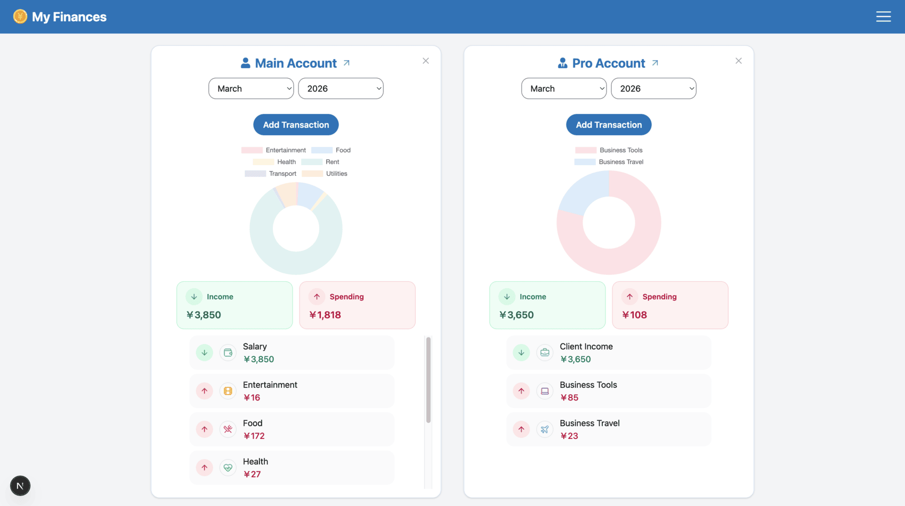
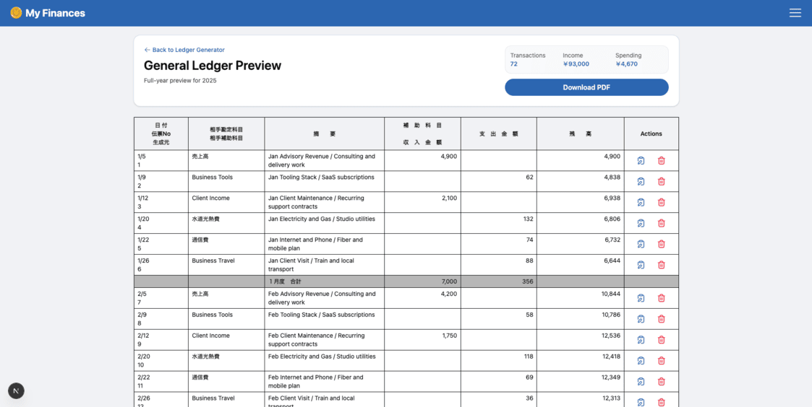
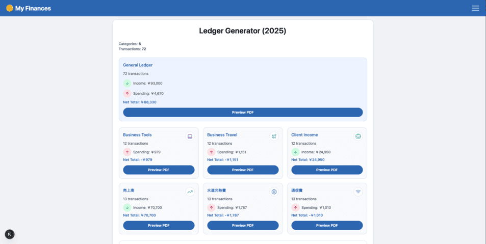

# My Spending

[](https://nextjs.org/)
[](https://react.dev/)
[](https://www.typescriptlang.org/)
[](https://supabase.com/)
[](https://vitest.dev/)

My Spending is a finance tracking app to manage accounts, record transactions, monitor monthly activity, and generate accounting-ready ledger previews.

Track your finances from daily entries to accounting-style ledger exports in one workflow.

## Quick Start

### 1) Clone the project

```bash
gh repo clone ColinBertin/my-spending
cd my-spending
```

### 2) Install dependencies

```bash
npm install
```

### 3) Configure environment variables

Create a `.env.local` file at the project root:

```bash
NEXT_PUBLIC_SUPABASE_URL=****
NEXT_PUBLIC_SUPABASE_PUBLISHABLE_KEY=****
SUPABASE_SERVICE_ROLE_KEY=****
```

### 4) Run the app

```bash
npm run dev
```

Open [http://localhost:3000](http://localhost:3000).

### 5) Run tests (recommended)

```bash
npm run test
```

`npm run test` runs the full test suite once using Vitest (good for CI and quick verification before pushing).

For local development, use watch mode:

```bash
npm run test:watch
```

`npm run test:watch` re-runs related tests when files change, which is useful while implementing features or fixing bugs.

### 6) Run quality checks (recommended)

```bash
npm run lint
npm run type-check
```

## What This App Does

- Provides authenticated personal/business finance tracking.
- Organizes money data by accounts, categories, and transactions.
- Gives monthly and category-based summaries.
- Offers a professional ledger generation flow for reporting and accounting tasks.

## What Users Can Do

- Create accounts with:
  - Type: `single`, `shared`, `professional`
  - Currency: `JPY`, `EUR`, `USD`
- Create categories (normal/professional) with custom icon and color.
- Add transactions with title, amount, type (`income`/`expense`), date, note, and category.
- Filter transactions by month/year on account details.
- View transaction charts and lists.
- Update or delete transactions from the ledger preview.
- Delete accounts with confirmation safeguards.

## What Users Can Generate

- General ledger preview for the previous year.
- Category-based ledger previews.
- January adjustment ledgers for special accounting cases.
- PDF output through print-ready ledger pages.

## Typical User Flow

1. Create one or more accounts.
2. Create categories.
3. Add income and expense transactions.
4. Review monthly account activity.
5. Open **Pro: Generate Ledger**.
6. Preview and export ledger documents.

## Screenshots

### Dashboard



### Ledger Generator



### Ledger Preview



## Tech Stack

- Next.js (App Router) + React + TypeScript
- Supabase (Auth + database)
- Tailwind CSS
- Chart.js / react-chartjs-2
- Vitest + Testing Library
